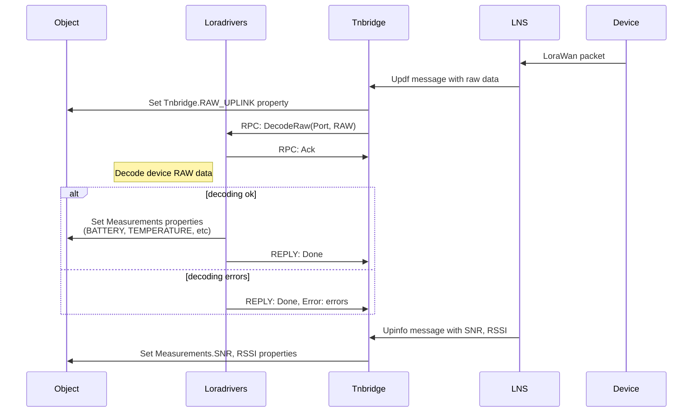
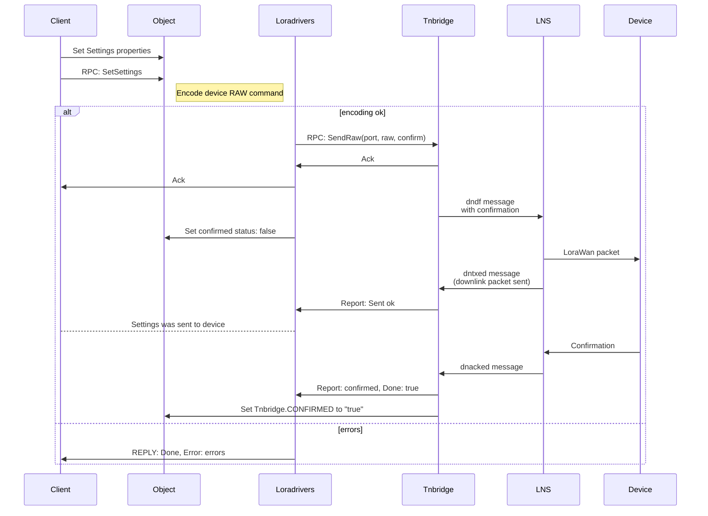
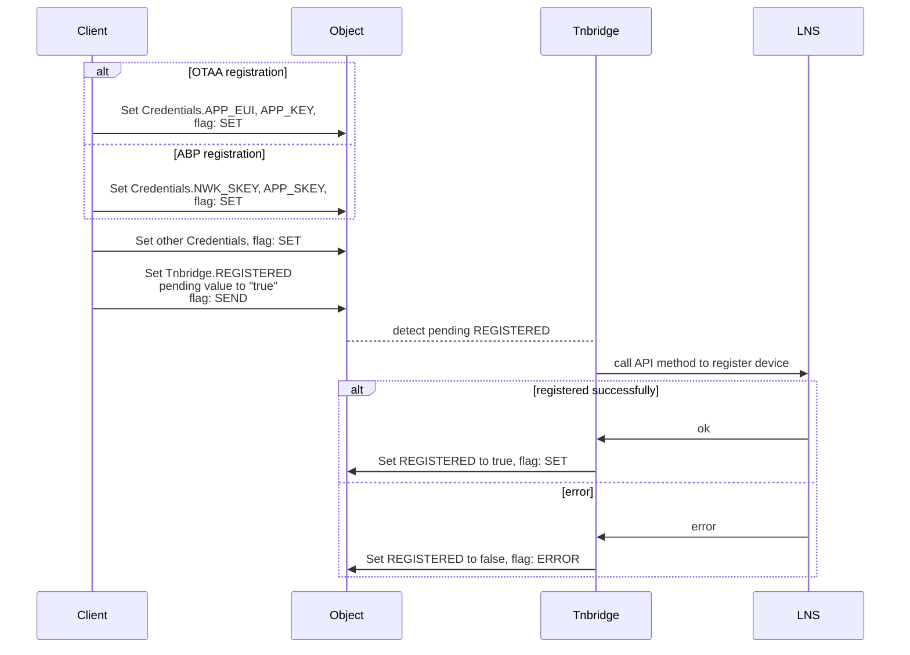

# Pix LNS Bridge

[](https://gl.thingularity.online/pixelcore/pix-lns-bridge/-/commits/master)
[](https://gl.thingularity.online/pixelcore/pix-lns-bridge/-/commits/master)

## About the Application

`pixlnsbridge` is a component of `Pixel Application Server` that provides bi-directional connectivity between TrackCentral network server and applications or services with generic data stream format.

`pixlnsbridge` use objects configuration represented by `Loradrivers` service (encode/decode device data from raw formats to human readable data), and provides two generic devices:
- Generic lora device
- Generic router

# Workflow diagrams

## Uplink



## Downlink with drivers



# Lora specific properties

## Measurements

```yaml
Measurements:
  BATTERY_LEVEL:
    name: Battery level
    units: '%'
    type: double
  DC_POWER:
    name: DC Power
    type: bool
  LORA_FCNTUP:
    name: Lora FCntUp
    type: double
  LORA_RSSI:
    name: Lora RSSI
    type: double
  LORA_SNR:
    name: Lora SNR
    type: double
```

## Credentials
Every Lora driver have Lora credentials, which can be used by `Tnbridge` to register device in the LNS.

```yaml
spec:
  Credentials:
    APP_EUI:
      name: AppEUI
      type: string
    APP_KEY:
      name: AppKey
      type: string
    APP_SKEY:
      name: AppSKey
      type: string
    D_CLASS:
      name: DeviceClass
      type: string
    D_VERSION:
      name: Version
      type: string
    DEV_ADDR:
      name: DevAddr
      type: string
    EUI:
      name: EUI
      type: string
    L_REGION:
      name: Region
      type: string
    NWK_KEY:
      name: NwkKey
      type: string
    NWK_SKEY:
      name: NwkSKey
      type: string
```

## Registration device in LNS




# Configuration

There are three ways to configure `pixlnsbridge`: сonfiguration file,  environment variables and command line arguments. It should be noted that the configuration methods override each other in the following order (where environment variables have highest priority):
- Configuration file;
- Command line arguments;
- Environment variables.


### Configuration File
Base configuration is stored in `pixlnsbridge.toml` file.

> [TOML](https://github.com/toml-lang/toml) aims to be a minimal configuration file format that's easy to read due to obvious semantics.

```toml
# Tracknet bridge service config

allowinsecure = false # allow insecure TLS connections

schemataPath = "tnbridge/schemata" # path to dataschemas in yaml format

[tracknet]
host = "https://tn01.pixel-networks.com:7008/api/"
token = "token"
owner = "owner-c::4300"

[api]
url = "http://172.16.24.4:5000/graphql"
websocket = "ws://172.16.24.4:5000/graphql"
timeout = 20 # websocket timeout, sec
login = "tnbridge"
password = "password"
appID = "b3954045-6ba7-41dd-8002-13b364163a27"
loradriversID = "7d06ccf5-f531-460f-9573-27e8ccf2d013"

[groups]
read = "5d963ea1-cdf2-4e66-8f98-bc07d5f3ea07"
use = "5d963ea1-cdf2-4e66-8f98-bc07d5f3ea07"
edit = "5d963ea1-cdf2-4e66-8f98-bc07d5f3ea07"

[logging]
verbose = true
```


```
Usage of ./bin/tnbridge:
  -allowinsecure
    	Change value of AllowInsecure. (default false)
  -api-appid
    	Change value of Api-AppID. (default b3954045-6ba7-41dd-8002-13b364163a27)
  -api-login
    	Change value of Api-Login. (default tnbridge)
  -api-loradriversid
    	Change value of Api-LoradriversID. (default 7d06ccf5-f531-460f-9573-27e8ccf2d013)
  -api-password
    	Change value of Api-Password. (default XXX)
  -api-timeout
    	Change value of Api-Timeout. (default 20)
  -api-url
    	Change value of Api-Url. (default http://172.16.24.4:5000/graphql)
  -api-websocket
    	Change value of Api-Websocket. (default ws://172.16.24.4:5000/graphql)
  -groups-edit
    	Change value of Groups-Edit. (default 5d963ea1-cdf2-4e66-8f98-bc07d5f3ea07)
  -groups-read
    	Change value of Groups-Read. (default 5d963ea1-cdf2-4e66-8f98-bc07d5f3ea07)
  -groups-use
    	Change value of Groups-Use. (default 5d963ea1-cdf2-4e66-8f98-bc07d5f3ea07)
  -logging-verbose
    	Change value of Logging-Verbose. (default true)
  -schematapath
    	Change value of SchemataPath. (default tnbridge/schemata)
  -tracknet-host
    	Change value of Tracknet-Host. (default https://tn01.pixel-networks.com:7008/api/)
  -tracknet-owner
    	Change value of Tracknet-Owner. (default owner-c::4300)
  -tracknet-token
    	Change value of Tracknet-Token. (default XXX)
```

Generated environment variables:
```
   CONFIG_ALLOWINSECURE
   CONFIG_API_APPID
   CONFIG_API_LOGIN
   CONFIG_API_LORADRIVERSID
   CONFIG_API_PASSWORD
   CONFIG_API_TIMEOUT
   CONFIG_API_URL
   CONFIG_API_WEBSOCKET
   CONFIG_GROUPS_EDIT
   CONFIG_GROUPS_READ
   CONFIG_GROUPS_USE
   CONFIG_LOGGING_VERBOSE
   CONFIG_SCHEMATAPATH
   CONFIG_TRACKNET_HOST
   CONFIG_TRACKNET_OWNER
   CONFIG_TRACKNET_TOKEN
```

# Schemata

## Generic lora device schema

```yaml
# Generic LORA device
---
kind: DataSourceScheme
id: 70cf39da-4f17-4eae-ba0e-fd74014b7871
name: Generic Lora Device
description: Generic Lora device
meta:
  author: Pixel
  email: support@pixel-networks.com
  manufacturer: Pixel
  model: "Generic Lora"
  uuid: 70cf39da-4f17-4eae-ba0e-fd74014b7871
  version: "1.0.5"
  pictureId: 70cf39da-4f17-4eae-ba0e-fd74014b7871
  iconId: 23ce7931-eab7-4486-abb7-bb1ec4c1d8bc

  tags:
    - device
    - trackcentral
    - lora
    - generic

type: device
spec:
  Measurements:
    RAW_DATA:
      name: Raw uplink data
      type: hex
    PORT:
      name: Port
      type: int
      valueRange:
        - [0, 255]
    LORA_FCNTUP:
      name: "Frame counter, FCntUp"
      type: int
    LORA_SNR:
      name: "Lora SNR"
      type: int
    LORA_RSSI:
      name: "Lora RSSI"
      type: int
    BATTERY_LEVEL:
      name: "Battery level"
      Units: "%"
      type: int
    DC_POWER:
      name: "DC Power"
      type: bool
  Credentials:
    EUI:
      name: EUI
      type: hex
    DEV_ADDR:
      name: DevAddr
      type: hex
    NWK_SKEY:
      name: NwkSKey
      type: hex
    NWK_KEY:
      name: NwkKey
      type: hex
    APP_SKEY:
      name: AppSKey
      type: hex
    APP_KEY:
      name: AppKey
      type: hex
    APP_EUI:
      name: App EUI
      type: hex
    D_CLASS:
      name: Device class
      type: string
    L_REGION:
      name: Region
      type: string
    D_VERSION:
      name: Version
      type: string
  Tnbridge:
    RAW_UPLINK:
      name: Raw uplink message
      type: string
    RAW_DOWNLINK:
      name: Raw downlink message
      type: string
    CONFIRMED:
      name: Downlink confirmed
      type: bool
    REGISTERED:
      name: Register device
      type: bool
```

## Generic router schema

```yaml
# Generic LORA router
---
kind: DataSourceScheme
id: 77c3d53b-e4ed-48b9-b733-f9e8af56f7cb
name: Generic Lora Router
description: Generic Lora Router
meta:
  author: Pixel
  email: support@pixel-networks.com
  manufacturer: Pixel
  model: "Generic Lora Router"
  uuid: 77c3d53b-e4ed-48b9-b733-f9e8af56f7cb
  version: "1.0.5"
  pictureId: 77c3d53b-e4ed-48b9-b733-f9e8af56f7cb
  iconId: b069c76a-e2bd-4ad1-b6df-2cc685a84e24

  tags:
    - device
    - trackcentral
    - lora
    - generic
    - router

type: device
spec:
  Measurements:
    CONNECTED:
      name: "Connected"
      type: bool
      description: "Is the router connected?"
    CONNECTION:
      name: Connection
      type: string
      description: "String representation of connection"
    MANAGED:
      name: "Managed"
      type: string
    NAME:
      name: "Name"
      type: string
      description: "Name in LNS"
    HW_SPEC:
      name: "Hardware spec"
      type: string
    ROUTER_ID:
      name: "Router ID"
      type: string
    ROUTER_ID6:
      name: "Router ID V6"
      type: string
    MAC_ADDR:
      name: "Router MAC address"
      type: string
    CNT_UP:
      name: "Messages up"
      type: int
    CNT_DOWN:
      name: "Messages down"
      type: int
    FIRMWARE:
      name: "Firmware name and version"
      type: string
    LAST_UPTIME:
      name: "Last uptime"
      type: string
    LAST_DOWNTIME:
      name: "Last downtime"
      type: string
    LAST_CONNECT:
      name: "Last connect"
      type: string
    GPS_LAT:
      name: "GPS Latitude"
      type: float
      units: "Deg"
    GPS_LON:
      name: "GPS Longitude"
      type: float
      units: "Deg"
    GPS_STATUS:
      name: "GPS status"
      type: int
      values:
        0: "Not fix"
        1: "2D fix"
    BATTERY_LEVEL:
      name: "Battery level"
      Units: "%"
      type: int
    DC_POWER:
      name: "DC Power"
      type: bool
  Commands:
    REGISTER:
      name: Register router
      type: bool
```

# Registering Tnbridge

```graphql
mutation CreateBridge {
  createUser(
    input: {
      user: {
        id: "b3954045-6ba7-41dd-8002-13b364163a27"
        login: "tnbridge"
        password: "password"
        description: "Tracknet bridge"
        editorgroup: "5d963ea1-cdf2-4e66-8f98-bc07d5f3ea07"
        enabled: true
        mExternalId: "148e6122-1499-4a94-a2ab-76ea15c12549"
        tokenExp: { months: 11 }
        readergroup: "5d963ea1-cdf2-4e66-8f98-bc07d5f3ea07"
        usergroup: "5d963ea1-cdf2-4e66-8f98-bc07d5f3ea07"
      }
    }
  ) {
      clientMutationId
  }
}

mutation RegisterBridge {
  createUsersToGroup(
    input: {
      usersToGroup: {
        userId: "b3954045-6ba7-41dd-8002-13b364163a27"
        userGroupId: "5d963ea1-cdf2-4e66-8f98-bc07d5f3ea07"
      }
    }
  ) {
    clientMutationId
  }
}```
